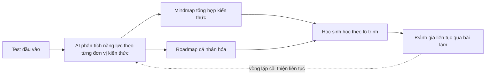

# Gia Sư AI Cá Nhân Hóa
### Báo cáo ý tưởng — chuẩn bị trao đổi với Mentor · Khởi Nguyên 2026, Vòng 2

**Deadline vòng 2:** 08/07/2026 &nbsp;·&nbsp; **Thời gian còn lại:** 5 ngày

---

**Giả định làm việc** *(nêu rõ để nhóm và mentor cùng điều chỉnh nếu cần)*
- Đối tượng ưu tiên: học sinh THCS–THPT, bắt đầu với 2 môn dễ lượng hóa năng lực nhất — **Toán** và **Tiếng Anh** — trước khi mở rộng sang môn khác.
- Coi "Gia Sư AI" là bản **tổng quát hóa** của ý tưởng chấm bài luận AI nhóm đã phát triển trước đó, không phải hướng thay thế hoàn toàn — chấm luận có thể trở thành một module trong hệ thống lớn hơn này (chi tiết Mục 6).
- Mục tiêu file này: đủ chất liệu để nhóm + mentor **chốt hướng đi**, chưa phải bản pitch hoàn chỉnh.

## Mục lục
1. Tóm tắt ý tưởng
2. Vấn đề cần giải quyết
3. Đối tượng người dùng
4. Giải pháp — 5 tính năng lõi
5. Đề xuất tính năng / góc nhìn bổ sung
6. Kết nối với ý tưởng chấm bài luận đã có
7. Kiến trúc công nghệ sơ bộ
8. Mô hình kinh doanh
9. Bối cảnh thị trường & đối thủ cạnh tranh
10. Điểm khác biệt đề xuất
11. Rủi ro cần lưu ý
12. Đề xuất phạm vi MVP cho 5 ngày còn lại
13. Câu hỏi gợi ý mang đến buổi mentor

---

## 1. Tóm tắt ý tưởng

**Gia Sư AI** làm 4 việc một gia sư giỏi vẫn làm — nhưng không đủ thời gian làm cho *từng em* trong lớp 40-45 học sinh:

1. **Đo** — đánh giá chính xác học sinh mạnh/yếu ở đâu, theo từng đơn vị kiến thức nhỏ chứ không chỉ theo môn.
2. **Vẽ** — tổng hợp bức tranh kiến thức đó thành **mindmap** trực quan.
3. **Dẫn đường** — xây **roadmap** học tập cá nhân hóa, đi đúng vào lỗ hổng của từng em.
4. **Đề xuất hành động** — bài tập nào nên làm trước, ôn gì, và cách biến điểm mạnh thành lợi thế thật sự (không chỉ vá điểm yếu).

Hầu hết đối thủ đang làm khá tốt phần "gợi ý bài học tiếp theo", nhưng ít ai làm tốt phần *trực quan hóa kiến thức* và *giải thích nguyên nhân gốc rễ* — đây là khoảng trống nhóm có thể khai thác (xem Mục 9-10).

## 2. Vấn đề cần giải quyết

- Sĩ số lớp truyền thống quá đông để giáo viên cá nhân hóa cho từng em; chương trình dạy theo tốc độ trung bình cả lớp.
- Học sinh thường chỉ biết mình "làm sai" chứ không biết *vì sao sai*. Ví dụ minh họa từ các hệ thống AI tutoring quốc tế: một học sinh làm đúng các bài đại số nhưng luôn chậm ở bài toán đố — nguyên nhân có thể không phải yếu tính toán mà là yếu đọc hiểu đề, và hai nguyên nhân này cần hai hướng khắc phục khác nhau hoàn toàn [1]. Chấm đúng/sai thông thường không phát hiện được sự khác biệt này.
- Phụ huynh gần như không có công cụ khách quan, có dữ liệu để theo dõi năng lực con.
- Tại Việt Nam, ước tính khoảng 60% sản phẩm EdTech hiện đã tích hợp AI dưới dạng module cá nhân hóa/gợi ý lộ trình [7], nhưng phần lớn dừng ở "gợi ý bài tiếp theo" — chưa làm tốt phần visualization (mindmap) hay giải thích nguyên nhân gốc rễ.

## 3. Đối tượng người dùng

| Nhóm | Vai trò | Vì sao ưu tiên |
|---|---|---|
| Học sinh THCS-THPT (lớp 8-12) | Người dùng chính | Giai đoạn áp lực thi cử cao nhất (chuyển cấp, tốt nghiệp THPT), sẵn sàng chi trả học thêm |
| Phụ huynh | Người trả tiền, theo dõi | Cần dữ liệu khách quan thay vì "cảm giác" |
| Giáo viên / trung tâm | Kênh phân phối B2B2C | Muốn công cụ xem tổng quan cả lớp thay vì chấm tay từng em |

Đề xuất môn mở đầu: **Toán** và **Tiếng Anh** — có ngân hàng câu hỏi rõ ràng, dễ đánh giá năng lực khách quan hơn Văn/Sử/Địa.

## 4. Giải pháp — 5 tính năng lõi

### 4.1 Đánh giá năng lực học sinh
- Bài **test chẩn đoán đầu vào** + **đánh giá liên tục** qua bài tập hàng ngày, không chỉ một bài kiểm tra duy nhất.
- Kỹ thuật: chia môn học thành hàng trăm–hàng nghìn "đơn vị kiến thức" nhỏ thay vì chấm theo chương lớn — cách tiếp cận này giúp định vị chính xác lỗ hổng, tương tự cách các hệ thống lớn phá vỡ chương trình học thành hàng chục nghìn điểm kiến thức nhỏ [2].
- Có thể bắt đầu đơn giản (tỷ lệ đúng theo từng đơn vị kiến thức), sau nâng cấp lên mô hình xác suất. Một số nghiên cứu ghi nhận Bayesian Knowledge Tracing đạt độ chính xác dự đoán khoảng 72%, còn mô hình deep learning (Deep Knowledge Tracing) đạt khoảng 81% [3]. Với 5 ngày còn lại, bản demo chỉ cần chứng minh đúng logic, chưa cần độ chính xác cao.

### 4.2 Mindmap tổng hợp kiến thức
- AI tự sinh sơ đồ tư duy từ dữ liệu bài làm: chương nào đã nắm, chương nào còn hổng, mức độ thành thạo từng nhánh.
- Kỹ thuật: dùng LLM (Gemini Flash — nhóm đã có kinh nghiệm từ ý tưởng chấm luận) sinh cấu trúc cây (JSON), render bằng thư viện mindmap mã nguồn mở phía client (Markmap, Mind-Elixir…).
- Nên **cập nhật động** theo thời gian thực khi học sinh làm thêm bài, không phải ảnh tĩnh.

### 4.3 Roadmap học tập cá nhân hóa
- Sắp xếp lại thứ tự nội dung học dựa trên đầu ra bước đánh giá năng lực, không đi theo giáo trình cố định — ví dụ học sinh yếu phân số có thể được xếp học một đơn vị hình học trực quan trước để xây trực giác, rồi mới quay lại phép tính phân số [1].
- Có thể chia theo mục tiêu cụ thể: ôn giữa kỳ, ôn cuối kỳ, ôn thi tốt nghiệp THPT — mỗi mục tiêu có thời hạn và trọng số kiến thức khác nhau.

### 4.4 Phân tích điểm mạnh — điểm yếu
- Dashboard trực quan theo từng đơn vị kiến thức, không chỉ theo môn học chung chung.
- Quan trọng: phân tích **nguyên nhân gốc rễ** — phân biệt yếu vì thiếu kiến thức nền, vì tốc độ làm bài, hay vì đọc hiểu đề, thay vì chỉ liệt kê "yếu chương X".
- Với điểm mạnh: không chỉ ghi nhận mà gợi ý hướng phát triển — ví dụ học sinh mạnh Toán được gợi ý lộ trình ôn thi học sinh giỏi thay vì lặp lại bài cơ bản đã thành thạo.

### 4.5 Giải pháp phát triển điểm mạnh & khắc phục điểm yếu
- Với điểm yếu: tự sinh bài tập nhắm đúng đơn vị kiến thức còn yếu, áp dụng lặp lại ngắt quãng (spaced repetition).
- Với điểm mạnh: đề xuất nội dung nâng cao, lộ trình thi HSG/chuyên, hoặc định hướng khối thi phù hợp.
- Nên có cơ chế giải thích "vì sao AI gợi ý bài này" — tăng niềm tin của học sinh/phụ huynh, tránh cảm giác "hộp đen".

## 5. Đề xuất tính năng / góc nhìn bổ sung

Trả lời trực tiếp phần "phân tích thêm nhiều ý" — không cần làm hết, chọn lọc theo thời gian còn lại:

1. **Dự đoán điểm thi** — mô phỏng điểm thi tốt nghiệp THPT/giữa kỳ dựa trên tiến độ hiện tại, tạo cảm giác cấp bách giúp tăng engagement.
2. **Chatbot hỏi-đáp 24/7** — giải đáp bài tập tức thời, dùng chung hạ tầng LLM đã có.
3. **Bảng điều khiển phụ huynh** — báo cáo tuần/tháng tự động, là điểm bán hàng mạnh cho B2C.
4. **Bảng điều khiển giáo viên/trường** — xem tổng quan cả lớp, xác định học sinh cần hỗ trợ gấp → mở kênh B2B2C.
5. **Multi-modal input** — chụp ảnh bài tập viết tay để chấm/phân tích, dùng lại phần OCR chữ viết tay nhóm đã nghiên cứu.
6. **Gamification** — điểm thưởng, streak, bảng xếp hạng nhóm bạn. Đáng lưu ý: ngay cả nền tảng miễn phí có tiếng cũng gặp khó giữ chân người dùng — có ghi nhận chỉ khoảng 15% học sinh có quyền truy cập Khanmigo miễn phí sử dụng đều đặn [1]. Công nghệ tốt không tự động tạo ra thói quen sử dụng, cần thiết kế engagement ngay từ đầu.
7. **Học nhóm ảo** — ghép học sinh cùng trình độ/cùng lỗ hổng để ôn cùng nhau.
8. **Portfolio năng lực tích lũy** — hồ sơ theo thời gian, hỗ trợ định hướng nghề nghiệp/chọn khối thi.
9. **Giải thích được (explainability)** — AI luôn nêu căn cứ khi gợi ý, tránh "hộp đen"; các phân tích công cụ AI giáo dục gần đây cũng nhấn mạnh công cụ tốt nhất là công cụ giúp học sinh tự giải thích lại được khái niệm sau khi dùng, không chỉ đưa đáp án [4].
10. **Chế độ tiết kiệm dữ liệu/offline** — hướng tới học sinh vùng nông thôn, mở rộng thị trường ngoài đô thị lớn.

## 6. Kết nối với ý tưởng chấm bài luận đã có

Nhóm không cần bỏ hết phần đã làm. Ý tưởng chấm luận trước đó (Next.js + FastAPI + PostgreSQL + Gemini Flash, xử lý OCR chữ viết tay, mô hình freemium → B2B, sườn slide 19 trang bám rubric) có thể tái định vị thành:

- **Module đánh giá năng lực Viết/Văn** trong hệ thống Gia Sư AI tổng quát — bài luận chính là một dạng "bài test chẩn đoán" cho môn Ngữ văn.
- Stack kỹ thuật, mô hình doanh thu, cấu trúc slide **dùng lại gần như nguyên vẹn** — chỉ cần đóng khung câu chuyện sản phẩm rộng hơn: "không chỉ chấm luận, mà là gia sư AI đánh giá toàn diện năng lực học sinh, bắt đầu từ Văn/Viết."
- Đây là lợi thế thời gian rất lớn với deadline 5 ngày: có nền tảng kỹ thuật đã kiểm chứng, chỉ cần mở rộng phạm vi câu chuyện chứ không phải build từ 0.

## 7. Kiến trúc công nghệ sơ bộ

- **Frontend:** Next.js (giữ nguyên) + thư viện mindmap (Markmap/Mind-Elixir) + thư viện chart cho dashboard (Recharts/Chart.js).
- **Backend:** FastAPI (giữ nguyên) + mô hình dữ liệu "knowledge graph" (môn → chương → chủ đề → đơn vị kiến thức nhỏ).
- **Database:** PostgreSQL — lưu lịch sử làm bài, mức độ thành thạo từng đơn vị kiến thức theo thời gian.
- **AI/LLM:** Gemini Flash để sinh mindmap (JSON cây), sinh bài tập nhắm mục tiêu, giải thích nguyên nhân gốc rễ — chi phí thấp, phù hợp demo sinh viên.
- **Thuật toán đánh giá năng lực:** bắt đầu đơn giản (tỷ lệ đúng có trọng số theo độ khó câu hỏi) cho demo; ghi rõ trên slide đây là roadmap nâng cấp lên Bayesian/Deep Knowledge Tracing về sau. Ban giám khảo thường đánh giá cao việc nhóm hiểu rõ giới hạn hiện tại và có lộ trình cải tiến, hơn là claim độ chính xác cao mà chưa có dữ liệu chứng minh.

## 8. Mô hình kinh doanh

- **B2C freemium:** miễn phí bài test chẩn đoán + xem điểm mạnh/yếu cơ bản; trả phí để mở khóa roadmap chi tiết, bài tập không giới hạn, bảng điều khiển phụ huynh.
- **B2B2C:** license cho trường/trung tâm, giáo viên dùng bảng điều khiển tổng quan lớp — một hợp đồng trường thường mang lại quy mô người dùng lớn hơn nhiều so với B2C thuần.
- Có thể dùng lại gần như nguyên mô hình freemium → B2B nhóm đã thiết kế cho phần chấm luận.

## 9. Bối cảnh thị trường & đối thủ cạnh tranh

**Thị trường:** EdTech Việt Nam hiện có quy mô ước tính khoảng 5 tỷ USD, tốc độ tăng trưởng kép hàng năm khoảng 11-13% giai đoạn 2025-2026, nằm trong top 10 thị trường EdTech tăng trưởng nhanh nhất thế giới và top 3 Đông Nam Á [6][7]. Bối cảnh thuận lợi để pitch, nhưng cũng đồng nghĩa cạnh tranh không nhỏ.

**⚠️ Lưu ý quan trọng nhất khi chuẩn bị pitch:** Vuihoc — một trong những nền tảng EdTech lớn nhất Việt Nam, vừa gọi vốn 6 triệu USD vòng Series A — mới công bố hợp tác chiến lược và sẽ đẩy mạnh dùng AI để phân tích điểm mạnh/điểm yếu từng học sinh và cá nhân hóa lộ trình học tập [8] — gần như đúng ý tưởng cốt lõi ban đầu của nhóm. Điều này không có nghĩa ý tưởng không còn giá trị, mà có nghĩa là phần **khác biệt hóa** (Mục 10) bắt buộc phải cụ thể ngay từ vòng 2, chứ không thể dừng ở "chúng tôi cũng làm AI cá nhân hóa".

| Đối thủ | Điểm mạnh | Khoảng trống nhóm có thể khai thác |
|---|---|---|
| Vuihoc | Vốn lớn, thương hiệu mạnh lớp 1-12, đã tuyên bố hướng đi tương tự [8] | Ít nhấn mạnh trực quan hóa (mindmap) và giải thích nguyên nhân gốc rễ |
| ELSA Speak | AI cá nhân hóa lộ trình rất mạnh, 10 triệu+ người dùng, top 5 thế giới [9] | Chỉ tập trung phát âm tiếng Anh, không đa môn |
| Marathon Education | Cam kết đầu ra, giáo viên top 1%, quỹ đầu tư lớn hậu thuẫn [10] | Mô hình dựa nhiều vào con người, khó scale bằng AI thuần, chi phí cao |
| Squirrel AI / Khanmigo (quốc tế) | Công nghệ trưởng thành, quy mô hàng chục triệu học sinh, đã có nghiên cứu độc lập cho thấy tăng tốc độ nắm vững kiến thức [4][5] | Chưa bản địa hóa cho chương trình GDPT 2018 của Việt Nam |

## 10. Điểm khác biệt đề xuất

Trước bối cảnh Mục 9, nên chọn 1-2 điểm sau làm "mũi nhọn" thay vì cố làm tất cả:

- **Trực quan hóa bằng mindmap động** — hầu hết đối thủ trên chỉ đưa dashboard số liệu, chưa ai nhấn mindmap sinh tự động như sản phẩm cốt lõi.
- **Giải thích nguyên nhân gốc rễ**, không chỉ điểm số — trả lời được "vì sao" chứ không chỉ "sai ở đâu".
- **Bản địa hóa theo chương trình GDPT 2018** — điểm yếu chung của các nền tảng quốc tế lớn.
- **Phát triển điểm mạnh thành lợi thế**, không chỉ vá điểm yếu — góc nhìn ít đối thủ khai thác rõ ràng.
- **Kế thừa nghiên cứu OCR chữ viết tay** từ ý tưởng chấm luận — rào cản kỹ thuật thật sự, không phải ai cũng làm tốt OCR tiếng Việt viết tay.

## 11. Rủi ro cần lưu ý

- **Thói quen sử dụng:** công nghệ tốt không tự động tạo người dùng trung thành — cần thiết kế gamification/engagement từ đầu (xem Mục 5).
- **Cold start:** học sinh mới chưa có đủ dữ liệu bài làm → mindmap/roadmap ban đầu có thể chưa chính xác; cần bài test chẩn đoán đủ tốt để giảm thiểu.
- **Bám sát chương trình GDPT 2018:** cần input chuyên môn sư phạm thật, không chỉ kỹ thuật — nên hỏi mentor có kết nối được giáo viên/chuyên gia nội dung không.
- **Dữ liệu trẻ vị thành niên:** học sinh dưới 18 tuổi — cần cam kết rõ về bảo mật dữ liệu, nên chủ động nêu trong pitch (thường là điểm cộng trước ban giám khảo).
- **Chi phí LLM khi scale:** Gemini Flash là lựa chọn hợp lý cho giai đoạn đầu, nhưng nên có ước tính chi phí/học sinh/tháng trong slide để chứng minh mô hình kinh doanh khả thi.

## 12. Đề xuất phạm vi MVP cho 5 ngày còn lại

Không nên cố làm đủ cả 5 tính năng ở mức hoàn chỉnh. Đề xuất:

- **Làm sâu 1 luồng, 1 môn** (gợi ý: Toán — dễ tạo ngân hàng câu hỏi mẫu nhanh): học sinh làm ~15-20 câu test chẩn đoán → dashboard điểm mạnh/yếu theo chủ đề → sinh mindmap + roadmap tương ứng.
- Các tính năng còn lại (chatbot, dashboard phụ huynh/giáo viên, gamification…) trình bày dưới dạng **roadmap sản phẩm trên slide**, không cần code demo.
- Tái sử dụng tối đa backend/OCR đã làm cho chấm luận nếu còn dư thời gian.
- Ưu tiên **1 demo nhỏ chạy mượt** hơn 5 tính năng dở dang — ban giám khảo thường đánh giá cao tính khả thi hơn độ "hoành tráng" của ý tưởng.

## 13. Câu hỏi gợi ý mang đến buổi mentor

1. Giữ chấm luận làm module con, hay dồn 100% lực vào Gia Sư AI đa môn?
2. Với 5 ngày, nên làm sâu 1 môn hay làm rộng-nông cả 5 tính năng?
3. Bắt đầu B2C hay đi thẳng B2B2C qua trường/trung tâm để có dữ liệu thật nhanh hơn?
4. Trước việc Vuihoc đã công bố hướng đi tương tự, điểm khác biệt nào là "bắt buộc phải có" để thuyết phục ban giám khảo ngay vòng 2?
5. Đo "năng lực" đáng tin cậy cần tối thiểu bao nhiêu câu hỏi/học sinh — hay vòng 2 chỉ cần chứng minh đúng logic, chưa cần độ chính xác cao?
6. Mentor có kết nối được giáo viên/chuyên gia nội dung để nhóm bám sát chương trình GDPT 2018 không?

---

## Nguồn tham khảo

[1] CallSphere Blog (3/2026) — AI Agents in Education: Khan Academy and Duolingo Deploy Autonomous Tutoring Agents to 50M Students
[2] Squirrel AI — trang chủ chính thức (squirrelai.com)
[3] Trilogy AI (Substack) — Empowering Learners with AI Tutors
[4] is4.ai (1/2026) — Top 10 AI Tutoring Systems in 2026: Do They Actually Work?
[5] TIME (5/2026) — TIME100 Most Influential Companies 2026: Squirrel AI Learning
[6] VnEconomy (8/2025) — Việt Nam nằm trong top 10 thị trường EdTech thế giới, top 3 thị trường Đông Nam Á
[7] VTV (8/2025) — Việt Nam nằm trong top 10 thị trường EdTech thế giới
[8] Vuihoc.vn — trang chủ chính thức
[9] ELSA Speak Việt Nam — trang chủ chính thức
[10] Marathon Education — trang chủ chính thức (marathon.edu.vn)
[11] Khởi Nguyên 2026 — trang chính thức (khoinguyen2026.rikkei.edu.vn)
